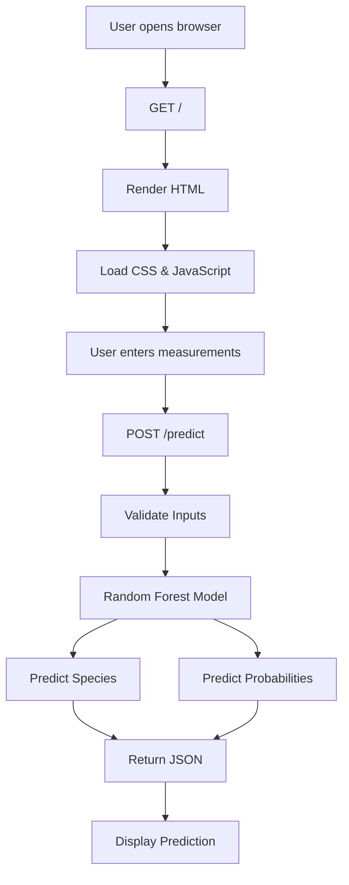

# 🌸 Iris Flower Species Predictor


A modern **Machine Learning Web Application** that predicts the species of an **Iris flower** using four physical measurements.

The application combines:

- 🌸 Random Forest Classifier
- ⚡ Flask Backend
- 🎨 Modern Responsive UI
- 🌙 Dark / Light Theme
- 📱 Mobile Friendly Interface
- 🚀 Deployment Ready

---

# 📑 Table of Contents

- Overview
- Screenshots
- Features
- System Architecture
- Training Pipeline
- Technology Stack
- Model Information
- Project Structure
- REST API
- Installation
- Retraining
- Deployment
- Future Improvements

---

# 📖 Overview

The application predicts one of the three Iris flower species:

- Iris-setosa
- Iris-versicolor
- Iris-virginica

Users simply enter:

- Sepal Length
- Sepal Width
- Petal Length
- Petal Width

and instantly receive

- ✅ Predicted Species
- ✅ Confidence Score
- ✅ Class Probabilities

Everything runs directly inside the browser through a Flask backend.

---

# 📸 Screenshots

## Home Page

<p align="center">
</p>

.png)

---

## Live Prediction

<p align="center">
</p>

.png)

---

# ✨ Features

- Predicts Iris flower species
- Random Forest Classifier
- 96.97% Accuracy
- Confidence Score
- Probability Distribution
- Responsive UI
- Dark / Light Theme
- Browser-based Prediction
- Flask REST API
- Automatic Model Loading
- Deployment Ready
- Clean Project Structure

---

# 🏗️ System Design



---

# 🧠 Model Training Pipeline


---

# 💻 Technology Stack

| Layer | Technology |
|-------|------------|
| Frontend | HTML, CSS, JavaScript |
| Backend | Flask |
| Machine Learning | Scikit-learn |
| Data Processing | Pandas |
| Model Storage | Joblib |
| Production | Gunicorn |
| Deployment | Procfile |

---

# 📊 Model Information

| Item | Value |
|------|-------|
| Dataset | Iris Dataset |
| Samples | 150 |
| Classes | 3 |
| Algorithm | Random Forest |
| Estimators | 120 |
| Accuracy | 96.97% |
| Train/Test Split | 80/20 |
| Random State | 42 |
| Model File | model.joblib |

---

# 📂 Project Structure

```text
iris-flower-predictor/

│
├── app.py
├── train_model.py
├── model.joblib
├── iris.data
├── iris.names
├── requirements.txt
├── Procfile
├── README.md
│
├── templates/
│     └── index.html
│
├── static/
│     ├── styles.css
│     └── script.js
│
└── docs/
      └── screenshots/
            ├── home-hero.png
            └── live-prediction.png
```

---

# 🔌 REST API

## GET /

Returns the homepage.

---

## POST /predict

### Request

```json
{
  "sepal_length": 5.1,
  "sepal_width": 3.5,
  "petal_length": 1.4,
  "petal_width": 0.2
}
```

### Response

```json
{
  "prediction": "Iris-setosa",
  "confidence": 98.33,
  "classes": [
    "Iris-setosa",
    "Iris-versicolor",
    "Iris-virginica"
  ],
  "probabilities": [
    98.33,
    1.67,
    0.00
  ]
}
```

---

# 🚀 Installation

Clone the repository

```bash
git clone https://github.com/yourusername/iris-flower-predictor.git
```

Move into the project

```bash
cd iris-flower-predictor
```

Create virtual environment

```bash
python -m venv .venv
```

Activate it

### Windows

```powershell
.\.venv\Scripts\Activate.ps1
```

### Linux / macOS

```bash
source .venv/bin/activate
```

Install dependencies

```bash
pip install -r requirements.txt
```

Run

```bash
python app.py
```

Open

```
http://127.0.0.1:5000
```

---

# 🔄 Retraining the Model

```bash
python train_model.py
```

This script

- Loads Iris Dataset
- Splits Training/Test Data
- Trains Random Forest
- Evaluates Accuracy
- Saves `model.joblib`

---

# ☁️ Deployment

The project includes a Procfile.

```text
web: gunicorn app:app
```

Suitable for

- Render
- Railway
- Heroku-compatible platforms

Build command

```bash
pip install -r requirements.txt
```

Start command

```bash
gunicorn app:app
```

---

# 🚀 Future Improvements

- Feature Importance Chart
- Probability Bar Graph
- Docker Support
- Unit Testing
- Model Metadata
- Prediction History
- CSV Batch Prediction
- Input Validation Hints

---

# 👨‍💻 Author

Built as a complete Machine Learning + Flask web application demonstrating how a trained classification model can be deployed into a modern browser-based interface.

⭐ If you found this project useful, consider giving the repository a star.
